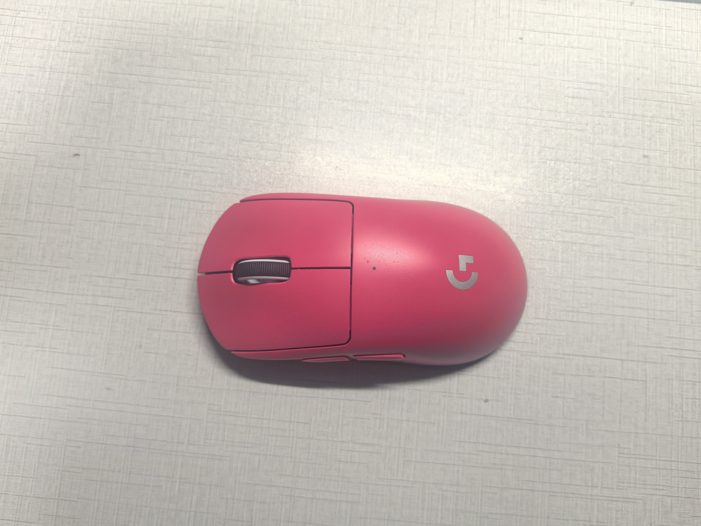
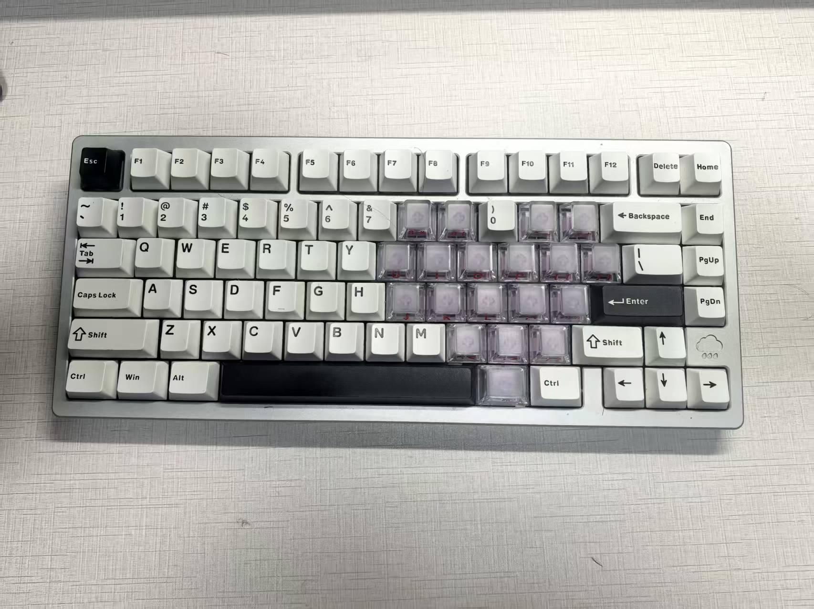
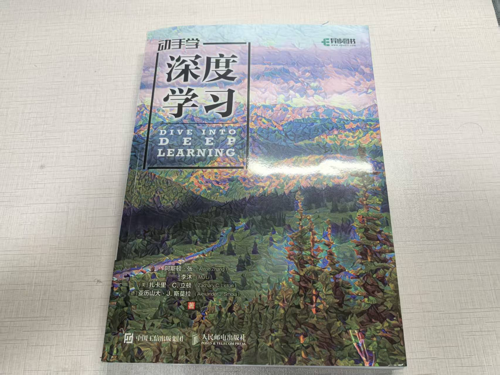

# Stage 02: Vision Features

## Vision Features

### goal

理解图像特征提取的基本流程，学习如何使用预训练模型把图片转换成特征向量。

### What I Will Do

- 加载一张本地图片
- 使用预训练 ResNet18 模型
- 去掉最后的分类层
- 提取图片的 feature vector
- 打印并理解特征向量的 shape

### Related Notes

- [ResNet 学习笔记](../notes/vision/resnet-notes.md)

### Key Concepts

- Feature:特征，是模型从图片中提取出来的数值表示，包含了图片的关键信息。
- Embedding:嵌入向量，是一种将高维数据转换成低维空间的表示方法，通常用于表示特征。
- Pretrained Model:预训练模型，是在大规模数据集上训练好的模型，可以直接用来提取特征或进行迁移学习。
- ResNet18:一种经典的卷积神经网络架构，具有18层，常用于图像分类和特征提取任务。
- Feature Extractor:特征提取器，是指去掉最后分类层的模型，用来提取图片的特征向量。
- PIL:Python Imaging Library，是一个用于处理图像的库，可以用来加载和预处理图片。

### Results

| Experiment | Input Image | Model | Feature Shape | Observation |
|---|---|---|---|---|
| Baseline |  | ResNet18 | [1, 512] | 成功从鼠标图片中提取图像特征 |

### questions

1. feature 和分类结果有什么区别？
    feature是模型提取图片所得的特征采用数值表示的方式，分类结果是模型根据特征做出最后的判断对图片做的类别区分，可以理解成feature是模型对图片的理解，而分类结果是模型对图片的判断，我们可以通过feature得到分类结果。

2. 为什么要使用预训练模型？
    预训练模型是在大规模数据集上训练好的模型，已经学会了如何从图片中提取有用的特征。使用预训练模型可以节省大量的训练时间和计算资源，同时也能获得更好的性能，尤其是在数据有限的情况下。

3. 图片进入 ResNet18 前需要做哪些预处理？
    首先要通过Resize把图片按短边缩放到256，然后通过CentreCrop裁剪出中心的224×224，接在用ToTensor将图片转换成张量，最后通过Normalize对图片进行归一化处理，使得输入数据的分布更适合模型的训练。

4. ResNet18 去掉最后分类层后输出的是什么？
    去掉最后分类层后，ResNet18 输出的是一个512维的特征向量，这个特征向量包含了图片的关键信息，可以用来进行后续的任务，比如图像检索、图像生成等。

5. 图像特征对后续机械臂项目有什么用？
    图像特征可以帮助机械臂理解周围环境中的物体和场景，从而做出更智能的决策。比如在抓取任务中，机械臂可以通过图像特征识别目标物体的位置、形状和类别，从而调整抓取策略，提高成功率。此外，图像特征还可以用于路径规划、避障等任务，使机械臂能够更安全高效地完成任务。

### Code Questions

这些问题来自代码中的 `#？` 标记，用来记录当前不理解或需要继续追问的地方。

1. `transforms.CenterCrop(224)` 对图片尺寸的改变，会不会丢失判断物体形状所需的信息？
    CenterCrop(224) 可能会丢失图片边缘信息。如果物体位于中心且主体完整，影响较小；如果物体靠边或太大，可能裁掉部分形状信息。这里使用它是因为 ResNet18 预训练模型通常需要 224×224 的输入尺寸，是一种标准预处理方式。

2. `transforms.ToTensor()` 之后为什么还要使用 `Normalize`，其中的 mean 和 std 参数为什么是这些值？
    `transforms.ToTensor()` 将图片转换成张量，并将像素值归一化到 [0, 1] 范围。`Normalize` 是为了进一步标准化输入数据，使其符合预训练模型的期望输入分布。mean 和 std 参数是根据 ImageNet 数据集计算得出的均值和标准差，因为 ResNet18 是在 ImageNet 上预训练的，所以使用这些值可以让输入数据更适合模型。

3. `Image.open(image_path).convert("RGB")` 为什么要把图片转成 RGB？
    将图片转换成 RGB 是为了确保输入模型的图片具有三个颜色通道（红、绿、蓝）。有些图片可能是灰度图（单通道）或者具有透明通道（RGBA），而 ResNet18 预训练模型期望输入是 RGB 格式的图片，因此需要进行转换。

4. `image_tensor.unsqueeze(0)` 为什么要增加一维，这一维的作用是什么？
    ResNet18 预训练模型期望输入的形状是 [batch_size, channels, height, width]。`unsqueeze(0)` 是为了在第0维增加一个维度，使得输入的形状从 [channels, height, width] 变成 [1, channels, height, width]，表示一个批次中只有一张图片。

5. `models.ResNet18_Weights.DEFAULT` 中的权重是什么意思？
    `models.ResNet18_Weights.DEFAULT` 是 PyTorch 提供的一种方式来加载预训练模型的权重。它表示使用 ResNet18 模型在 ImageNet 数据集上预训练的权重，这些权重包含了模型在大量图像上学习到的特征提取能力，可以直接用于特征提取或迁移学习。

6. `model.fc = nn.Identity()` 这行代码的作用是什么？
    这行代码的作用是将 ResNet18 模型的最后一个全连接层（分类层）替换为一个恒等映射（Identity）。这样做的目的是去掉分类层，使得模型输出的是特征向量而不是分类结果。通过这种方式，我们可以直接获取图片的特征表示，而不需要进行分类。

### Reflection

This part I learned:

1. 通过使用预训练的 ResNet18 模型，从图片中提取出有用的特征向量，这些特征向量包含了图片的关键信息，可以用于后续的任务。
2. 了解了图像特征提取的基本流程，包括图片预处理、模型加载、去掉分类层以及提取特征向量的步骤。
3. 学会了如何使用 PyTorch 的 transforms 来对图片进行预处理，以及如何使用预训练模型来提取特征。

## CLIP Image-Text Matching

### goal

理解 CLIP 的基本用法，学习如何让图片和文本描述进行相似度匹配。

### What I Will Do

- 加载 CLIP 模型
- 准备一张测试图片
- 准备多个候选文本
- 计算图片和文本之间的相似度
- 输出最匹配的文本描述

### Key Concepts

- CLIP: 一种图文对齐模型，可以把图片和文本都转换成向量，并比较二者是否匹配。最重要的就是图片和文本编码器
- Image Embedding: 图片经过 CLIP 图像编码器后得到的向量表示。
- Text Embedding: 文本经过 CLIP 文本编码器后得到的向量表示。
- Similarity: 图片向量和文本向量之间的相似程度，相似度越高表示越匹配。
- Prompt: 输入给 CLIP 的文本描述，例如 `a photo of a mouse`。

### Results

| Experiment | Image | Candidate Texts | Prediction | Correct |
|---|---|---|---|---|
| Baseline |  | mouse / keyboard / cup / book / phone | a photo of a mouse | Yes |
| Exp 1 |  | mouse / keyboard / cup / book / phone | a photo of a keyboard | Yes |
| Exp 2 |  | mouse / keyboard / cup / book / phone | a photo of a book | Yes |

exp2：这张图片最符合的描述是a photo of a book
a photo of a mouse: 0.0001
a photo of a keyboard: 0.0002
a photo of a cup: 0.0010
a photo of a book: 0.9981
a photo of a phone: 0.0006

### questions

1. CLIP 和普通图像分类模型有什么区别？
    普通图像分类模型通常只能在固定类别中输出分类结果，例如 CIFAR10 的 10 类。CLIP 不只是做固定类别分类，而是把图片和文本都编码成向量，通过比较相似度判断图片更符合哪一句文本描述。

2. CLIP 为什么可以比较图片和文本？
    因为 CLIP 在训练时同时学习图片和文本之间的对应关系，把匹配的图片和文本拉近，把不匹配的图片和文本拉远。训练完成后，图片向量和文本向量就可以放在同一个语义空间中比较。

3. image embedding 和 text embedding 分别是什么？
    image embedding 是图片经过图像编码器后得到的数字向量，text embedding 是文本经过文本编码器后得到的数字向量。它们都是模型可以计算和比较的语义表示。

4. similarity 越高代表什么？
    similarity 越高，表示图片向量和文本向量越接近，也就是图片越符合这句文本描述。

5. CLIP 对后续具身智能项目有什么帮助？
    CLIP 可以让机器人把视觉信息和语言描述联系起来。后续机械臂任务中，可以用它辅助判断“当前看到的物体更像哪种描述”，例如区分鼠标、杯子、盒子，或者根据语言指令选择目标物体。

### Code Questions

这些问题来自 `clip_match_reference.py` 中的 `#？` 标记，用来记录阅读参考代码时不理解或需要继续追问的地方。

1. `CLIPProcessor` 是什么？
    `CLIPProcessor` 是 Hugging Face 提供的 CLIP 输入处理器。它负责把图片和文本转换成 CLIP 模型可以接收的输入格式，包括图片预处理、文本分词、padding 和转换成 PyTorch tensor。

2. `CLIPProcessor.from_pretrained(MODEL_NAME)` 的作用是什么？
    这行代码会根据指定的 CLIP 模型名称加载对应的 processor 配置。不同 CLIP 模型可能有不同的图片尺寸、归一化参数和分词方式，所以 processor 要和模型配套使用。

3. 为什么 `load_clip()` 需要同时返回 `processor` 和 `model`？
    因为二者分工不同：`processor` 负责把原始图片和文本整理成模型输入，`model` 负责真正的前向传播和相似度计算。没有 processor，图片和文本不能直接送进模型；没有 model，就无法得到匹配结果。

4. `return_tensors="pt"` 的作用是什么？
    它表示让 processor 返回 PyTorch tensor。`pt` 是 PyTorch 的缩写。如果不设置这个参数，返回的数据格式可能不是 PyTorch 模型可以直接使用的 tensor。

5. `padding=True` 的作用是什么？
    文本长度可能不同，例如 `a photo of a cup` 和 `a photo of a keyboard` 的 token 数不完全一样。`padding=True` 会把不同长度的文本补齐到同一长度，方便组成一个 batch 一起送入模型。

6. `logits.softmax(dim=1)[0]` 为什么可以直接使用，后面的参数是什么意思？
    `logits` 是 CLIP 输出的图片与每个文本之间的匹配分数，形状通常是 `[图片数量, 文本数量]`。当前只有一张图片，所以形状可以理解为 `[1, 5]`。`softmax(dim=1)` 表示在“文本候选”这一维上把分数转换成概率；`[0]` 表示取出第一张图片对应的概率列表。

### Reflection

This stage I learned:

1. 学会了使用 CLIP 同时处理图片和文本，并输出图片与候选文本之间的匹配结果。
2. 理解了 `processor` 负责把 PIL 图片和文本列表转换成模型输入，真正的前向传播发生在 `model(**inputs)`。
3. 初步理解了图文匹配的基本流程：图片和文本分别变成 embedding，再通过相似度判断是否匹配。
