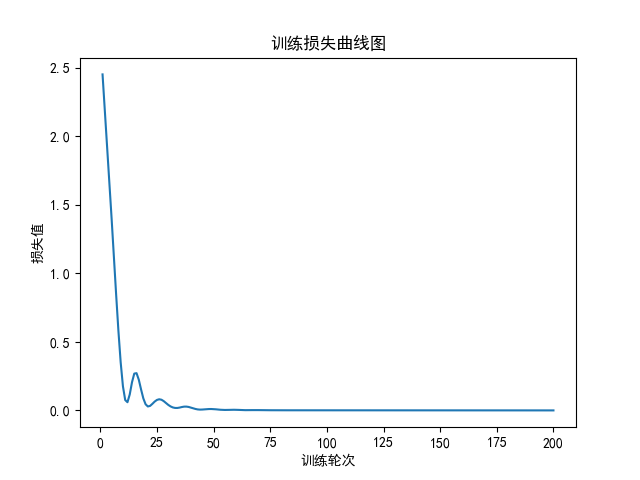
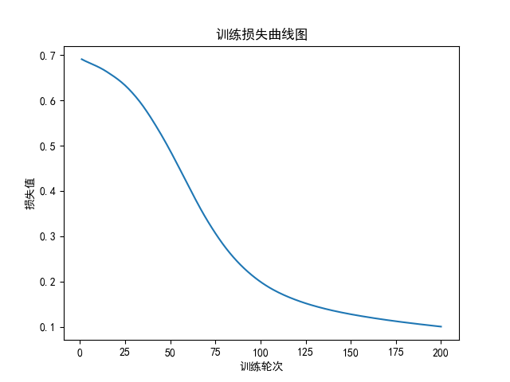

# Stage 04: Behavior Cloning

## Goal

理解模仿学习的最小闭环：用数据学习一个从 observation 到 action 的 policy。

本阶段重点不是一开始复现复杂论文，而是先理解：

```text
observation -> policy -> action
```

也就是：

```python
action = policy(observation)
```

## What I Will Do

- 先构造一个简单规则 policy
- 用规则 policy 生成 observation / action 数据
- 用 PyTorch 训练一个小模型模仿这个规则 policy
- 比较模型输出 action 和规则 action 的差距
- 把 toy 数据迁移到 CartPole 仿真数据，理解从环境中采集 demonstration 的过程
- 再进入 ManiSkill / robomimic / LeRobot 的真实 demonstration 数据

## Repository Structure

```text
stage04-behavior-cloning/
  README.md
  toy_bc/
    toy_bc_reference.py
    toy_bc.py
    images/
      toy_bc_loss_curve.png
  cartpole_bc/
    cartpole_bc_reference.py
    cartpole_bc.py
    cartpole_bc_rollout.py
    cartpole_bc_save_load.py
    cartpole_demonstration_dataset.py
    data/
      cartpole_demo.npz
```

## Learning Logic Chain

```text
random policy
-> action = env.action_space.sample()
-> policy should depend on observation
-> collect observation / action pairs
-> train model to imitate action
-> behavior cloning
-> evaluate predicted action
-> robot demonstration data
```

This stage connects robot simulation interaction to learnable robot policies.

## Key Concepts

- Policy: 根据 observation 输出 action 的规则或模型。
- Expert Policy: 用来生成示范数据的专家策略，可以是真人、规则控制器或已有模型。
- Demonstration: 专家执行任务时留下的 observation / action 数据。
- Behavior Cloning: 行为克隆，用监督学习模仿专家动作。
- Observation: 策略输入，可以是状态向量、图像、机器人关节状态等。
- Action: 策略输出，可以是关节控制量、末端位姿变化、夹爪开合等。
- Dataset: 由 observation 和 action 组成的训练数据。
- Loss: 预测 action 和专家 action 的误差。
- Evaluation: 检查训练出的 policy 是否能在环境中完成任务。

## Results

| Experiment | Data Source | Model | Output | Observation |
|---|---|---|---|---|
| Baseline | rule policy toy data | MLP | final_loss=0.000378 | 成功学习 `[x, y] -> [2x, -y]` |
| Loss Curve | rule policy toy data | MLP |  | loss 持续下降，说明模型在模仿专家规则 |
| CartPole BC | expert policy from CartPole observation | MLP classifier |  | 从仿真环境采集 observation/action 数据，并训练模型模仿专家动作 |
| CartPole Rollout | learned policy vs random policy | MLP classifier | learned reward=46.0, random reward=23.8 | learned policy 回到环境中运行 5 个 episode，平均表现高于 random policy |
| CartPole Save / Load | saved `state_dict` | loaded MLP classifier | reward=54.0, steps=54 | 保存训练后的参数，再加载到新模型中执行 rollout |
| CartPole Demonstration Dataset | expert policy episodes | `.npz` dataset | episodes=5, first_episode_len=27 | 保存并加载 episode 结构的 demonstration 数据 |

## Rollout Comparison

本实验不再只看单个样本预测，而是让训练后的 policy 回到 `CartPole-v1` 环境中连续行动，并与 random policy 对比。

```text
learned average reward:46.0
learned average steps:46.0
random average reward:23.8
random average stpes:23.8
```

| Policy | Average Reward | Average Steps | Meaning |
|---|---:|---:|---|
| Learned policy | 46.0 | 46.0 | 根据 observation 输出动作，已经学到一部分平衡规律 |
| Random policy | 23.8 | 23.8 | 随机采样动作，没有利用 observation 信息 |

阶段结论：

```text
expert_policy
-> collect_data
-> train_model
-> learned policy rollout
-> random policy comparison
```

这说明本阶段已经从“模型能预测 action”推进到“模型能在环境中执行 action 并得到更高平均回报”。

## Save And Load

本实验把训练和使用解耦：训练完成后保存模型参数，再创建新模型加载参数，用加载后的模型执行 rollout。

```text
train model
-> torch.save(model.state_dict())
-> create new PolicyNet()
-> load_state_dict()
-> loaded model rollout
```

运行结果：

```text
reward:54.0
steps:54
```

关键理解：

- 保存 `model.state_dict()` 是保存模型学到的参数状态，而不是保存整个 Python 类对象。
- 加载时要先创建同结构的 `PolicyNet()`，再把保存的参数填进去。
- `loaded_model=load_model(model_path)` 后使用 `run_one_episode(loaded_model)`，说明 rollout 使用的是加载后的模型。
- `MODEL_PATH` 应该指向具体 `.pth` 文件，例如 `./models/cartpole_bc_policy.pth`，而不是只写文件夹名。

## Demonstration Dataset

本实验模拟真实机械臂 demonstration 数据结构：不再只是在内存里临时训练，而是把 expert policy 产生的连续 episode 保存成数据集文件。

数据采集链路：

```text
expert_policy
-> collect_one_episode
-> collect_many_episodes
-> save_dataset
-> load_dataset
-> inspect_dataset
```

单条 episode 的数据结构：

```python
episode = {
    "observations": observations,
    "actions": actions,
    "rewards": rewards,
    "terminated": terminated,
    "truncated": truncated,
}
```

运行结果：

```text
episodes数量：5
observation shape:(27, 4)
action shape:(27,)
reward shape:(27,)
```

结果含义：

- 一共保存了 5 条 episode。
- 第 1 条 episode 长度为 27 步。
- 每一步 observation 是 CartPole 的 4 维状态。
- `observations/actions/rewards` 第一维一致，说明每个 `observation[t]` 都对应 `action[t]` 和 `reward[t]`。
- 不同 episode 的长度可能不同，因此保存时使用 `np.array(episodes, dtype=object)`。

保存与加载：

```python
np.savez(dataset_path, episodes=np.array(episodes, dtype=object))
data = np.load(dataset_path, allow_pickle=True)
episodes = data["episodes"]
```

路径处理：

```python
BASE_DIR = os.path.dirname(os.path.abspath(__file__))
DATASET_PATH = os.path.join(BASE_DIR, "data", "cartpole_demo.npz")
```

这样无论从 VS Code、终端还是仓库根目录运行，数据都会保存到当前脚本所在目录下的 `data/cartpole_demo.npz`。

## Questions

1. random policy 和 learned policy 有什么区别？
    random policy是完全随机动作并没有规则的约束，而learning policy是通过观察数据学习到一个从 observation 到 action 的映射关系，能够根据输入状态输出合理的动作。

2. behavior cloning 为什么可以看成监督学习？
    因为 behavior cloning 的训练过程就是在给定 observation 的情况下，预测 expert action，并通过计算 predicted action 和 expert action 之间的 loss 来更新模型参数。这和传统的监督学习非常类似，都是输入特征（observation）和对应标签（expert action）的关系。

3. observation / action 数据对是什么？
    observation / action 数据对是指在某个时间点，环境的状态（observation）和专家在这个状态下采取的动作（action）。这些数据对构成了训练模型模仿专家行为的基础。

4. expert policy 可以来自哪里？
    expert policy 可以来自人类遥操作、规则控制器、已有的强化学习模型或真实机械臂的示范数据。关键是它能在环境中产生合理的 observation/action 数据对。

5. loss 应该怎么计算？
    loss 通常是 predicted action 和 expert action 之间的误差。对于连续动作，可以使用 MSELoss；对于离散动作，可以使用 CrossEntropyLoss。loss 的数值越小，说明模型预测的动作越接近专家动作。

6. 为什么只看训练 loss 不够？
    训练 loss 只能说明模型在训练数据上拟合得好不好，但不能保证模型在环境中执行时表现好。因为模型可能过拟合训练数据，或者训练数据本身覆盖不够，导致模型在实际 rollout 时遇到没见过的状态就输出错误动作。

7. behavior cloning 和最终机械臂项目有什么关系？
    最终机械臂项目中可以把人类遥操作或专家控制器产生的数据看作 demonstration。Behavior cloning 的作用就是让模型学习 `observation -> expert_action` 的映射，使模型在看到类似状态时输出类似专家的动作。

8. 为什么真实机械臂数据通常按 episode 保存？
   真实机械臂数据按 episode 保存，是因为一次任务是连续过程，observation 和 action 有时间顺序。一个 episode 表示一次完整任务尝试，例如从开始移动到抓取成功或失败。

9.  observations 和 actions 的长度应该一样吗？
    是的，通常每个 observation 对应一个 action，所以它们的长度应该一样。每条数据记录了在某个 observation 下专家采取的 action。

10. rewards 对 behavior cloning 训练是必须的吗？
    rewards 对 behavior cloning 训练不是必须的。BC 主要使用 observations 和 actions 做监督学习；reward 可以用于分析成功失败、筛选数据或评估 episode 质量。
    
11. 为什么保存数据后还要写 load_dataset 和 inspect_dataset？
    load_dataset 用来确认保存的数据能被重新读取；inspect_dataset 用来检查 episode 数量、每个字段的 shape、数据长度是否一致，防止后续训练时才发现数据格式错误。

12. 为什么 `observations/actions/rewards` 要长度一致？
    当前任务要构造 BC 训练数据，每个 `observation[t]` 对应专家采取的 `action[t]`。如果 observation 在 `env.step(action)` 后才保存，就会变成 `action[t]` 对应 `observation[t+1]`，导致数据错位。

13. 为什么 demonstration 数据按 episode 保存？
    一条 episode 是一次连续任务尝试，保留了状态和动作的时间顺序。真实机械臂任务不是孤立样本，而是连续控制过程，所以 episode 结构更接近真实数据。

## Code Questions

这些问题来自 `*_reference.py` 中的 `#？` 标记，用来记录阅读参考代码时不理解或需要继续追问的地方。

1. `nn.Sequential(...)` 这个神经网络的步骤是什么？
    `PolicyNet` 的输入是 observation，先经过 `Linear(OBS_DIM, 32)` 映射到隐藏特征，再经过 ReLU 增加非线性，然后继续经过一层隐藏层，最后用 `Linear(32, ACTION_DIM)` 输出 action。整体就是：`observation -> hidden feature -> hidden feature -> action`。

2. `nn.Linear(OBS_DIM, 32)` 为什么要输出 32 维隐藏特征？
    32 是人为设置的隐藏层宽度，用来给模型一定表达能力。输入只有 2 维，输出 action 也是 2 维，但中间用 32 维隐藏特征可以让模型学习更灵活的映射。这个数字不是唯一选择，可以改成 16、64 等，通过实验比较 loss。

3. 为什么用 `action_1 = 2 * x` 和 `action_2 = -1 * y` 计算动作维度？
    这是人为构造的 expert policy。它让每个 observation `[x, y]` 都有一个确定的专家动作 `[2x, -y]`，从而生成 supervised learning 数据。真实机械臂中，expert action 可能来自人类遥操作、规则控制器或示范数据。

4. `nn.MSELoss()` 是什么？
    MSELoss 是均方误差损失，用来衡量 predicted action 和 expert action 的数值差距。对于连续动作模仿，MSE 是最常见的基础损失之一，因为 action 通常是连续向量。

5. `optim.Adam(...)` 是什么优化器？
    Adam 是一种常用优化器，会根据梯度自动调整每个参数的更新幅度。相比基础 SGD，Adam 在很多神经网络训练中更容易稳定收敛，适合当前 toy behavior cloning。

6. 为什么每 20 轮打印一次 loss，能不能换成其他数字？
    每 20 轮打印一次只是为了观察训练过程，同时避免每一轮都打印导致输出太多。可以改成每 10 轮、50 轮或每轮打印；这只影响日志显示，不影响训练本身。

7. 为什么测试时使用 `torch.no_grad()`？
    测试阶段只需要前向计算 predicted action，不需要反向传播和梯度更新。`torch.no_grad()` 可以关闭梯度追踪，减少内存占用，也避免在转 numpy 或打印时遇到梯度相关问题。

8. CartPole 的 `observation` 各个量的物理意义是什么？
    CartPole 的 observation 是 4 维向量，通常可以理解为：小车位置、小车速度、杆子角度、杆子角速度。本阶段的 `expert_policy` 先只使用第三个量 `pole_angle`，根据杆子向左还是向右倾斜来决定动作。

9. 为什么 `observations` 要先经过 `np.array(observations)` 再转成 `torch.tensor`？
    `observations` 原本是一个 Python list，里面每个元素是 NumPy 数组。先用 `np.array` 可以把它整理成统一的二维数组 `[num_samples, obs_dim]`，再转成 PyTorch tensor。理论上可以直接 `torch.tensor(observations)`，但当 list 内部元素是 NumPy 数组时，先转 NumPy 更稳定，也能避免性能警告。

10. `CrossEntropyLoss` 和 `MSELoss` 分别适合什么情况？
    `MSELoss` 适合连续动作回归，例如 toy BC 中预测 `[2x, -y]` 这种连续 action。`CrossEntropyLoss` 适合离散分类，例如 CartPole 中 action 只有 `0` 和 `1` 两类，模型输出的是两个动作的 logits，真实标签必须是 `torch.long` 类型。

11. `(predictions == actions).float().mean().item()` 是怎么计算 accuracy 的？
    `predictions == actions` 得到每个样本是否预测正确的布尔结果；`.float()` 把 `True/False` 转成 `1.0/0.0`；`.mean()` 求平均值，就是正确率；`.item()` 把单元素 tensor 转成 Python 数字，方便打印和记录。

12. 为什么保存 `model.state_dict()`，不是直接保存 `model`？
    `state_dict()` 只保存模型参数和 buffer，更轻量、更稳定，也更符合 PyTorch 推荐做法。直接保存整个 model 会把 Python 类结构一起序列化，跨文件或跨环境加载时更容易出问题。

13. 为什么加载模型时要先创建新的 `PolicyNet()`？
    `state_dict` 只是参数字典，不包含模型结构。必须先创建同样结构的模型对象，才能用 `load_state_dict()` 把保存的参数填进去。

## Key Takeaways

这些关键点来自手敲代码中的 `#k` 标记。

1. `test_observation = torch.tensor([[0.2, 0.1]])` 中外层中括号表示 batch 维度，此时 batch size 为 1。模型输入通常写成 `[batch_size, obs_dim]`，即使只测试一个样本，也要保留 batch 维度。

2. 训练 loss 曲线可以帮助确认模型是否真的在学习。如果 loss 持续下降，说明 predicted action 正在接近 expert action。

3. CartPole BC 中的 action 是离散类别，模型最后输出的是 `[left_score, right_score]`，不是直接输出一个连续动作值。

4. `model(test_observation)` 需要输入 `[1, 4]` 这种带 batch 维度的张量；而 `expert_policy(test_observation[0])` 只需要单个 `[4]` observation。

5. `run_one_episode` 是把 learned policy 放回环境中的关键函数。它的核心不是再训练模型，而是在每一步执行 `action = select_action(model, observation)`，再把 action 传给 `env.step(action)`。

6. 多轮评估比单轮结果更可靠。单个 episode 的 reward 受初始状态影响较大，使用 5 个 episode 的 average reward 可以更稳定地比较 learned policy 和 random policy。

7. 保存和加载模型能把“训练阶段”和“使用阶段”分开。真实项目中通常先离线训练策略，再加载保存好的模型进行推理或部署。

8. demonstration 数据和训练数据不完全一样。demonstration 是原始专家轨迹，里面可以包含 observation、action、reward、done 等信息；BC 训练时通常主要取 observation/action 数据对。

9. 保存路径不能只依赖 `./data/...`，因为 `./` 指的是当前运行目录，不一定是脚本所在目录。使用 `__file__` 拼路径更稳定。

## Debug Log

这一部分记录手敲 CartPole BC 时遇到的问题和解决方法。

| Error | Cause | Fix | What I Learned |
|---|---|---|---|
| `TypeError: 'method' object is not iterable` | `model.parameters` 少写括号，传入的是方法本身 | 改为 `model.parameters()` | 优化器需要模型参数列表，而不是获取参数的方法 |
| `RuntimeError: expected scalar type Long but found Float` | `CrossEntropyLoss` 的标签 `actions` 被写成了 float | 改为 `dtype=torch.long` | 分类标签必须是整数类别编号，连续回归标签才常用 float |
| `ValueError: setting an array element with a sequence` | `env.reset()` 没有正确解包，导致 observation 混入 `(observation, info)` | 写成 `observation, info = env.reset()` | Gymnasium 的 `reset` 和 `step` 都要按返回值结构解包 |
| `plt.plot(...)` 维度或结构报错 | `epoch_range` 或 `epoch_loss` 中混入了非纯数字序列 | 使用 `epoch_range = range(1, EPOCHS + 1)`，并记录 `loss.item()` | 画图时 x 和 y 都必须是一维数字序列，且长度一致 |
| `IndexError: index 2 is out of bounds for dimension 0 with size 1` | 把 `[1, 4]` 的 batch 张量直接传给 `expert_policy` | 改为 `expert_policy(test_observation[0])` | 模型输入要 batch 维度，规则函数通常只处理单个 observation |
| rollout 初版中直接 `model(observation)` | `observation` 是环境返回的 NumPy 数组，且模型输出 logits 不是环境动作 | 增加 `observation_to_tensor` 和 `select_action` | rollout 中需要完成 `observation -> tensor -> logits -> action int` 的转换 |
| `MODEL_PATH="./models"` 路径不清晰 | 路径指向文件夹名，容易被当作文件保存，后续管理混乱 | 改成具体文件路径，如 `./models/cartpole_bc_policy.pth` | 保存模型时要区分目录和文件路径 |
| `ValueError: not enough values to unpack (expected 6, got 5)` | 把 `env.step(action)` 写成返回 6 个值，误以为环境会返回 action | 改成 `next_observation, reward, terminated, truncated, info = env.step(action)` | action 是传给环境的输入，不是环境返回值 |
| `FileNotFoundError: ./models/cartpole_demo.npz` | 保存路径依赖当前运行目录，且上级目录不存在 | 使用 `BASE_DIR = os.path.dirname(os.path.abspath(__file__))` 并在保存前 `os.makedirs(...)` | 项目代码里路径最好基于脚本位置，而不是当前工作目录 |
| 保存后 `data["episodes"]` 取不到 | `np.savez` 保存时没有命名字段，默认 key 会变成 `arr_0` | 写成 `np.savez(dataset_path, episodes=np.array(...))` | 保存结构化数据时要给字段命名，加载时才能按 key 读取 |
| `episode["osbervations"]` KeyError | 字典 key 拼写错误 | 改成 `episode["observations"]` | `inspect_dataset` 能帮助及时发现字段名和 shape 问题 |
| observations 比 actions 多 1 | 在循环前额外保存初始 observation，并在 step 后继续保存 | 改为每一步在 step 前保存当前 observation 和 action | BC 数据应对齐为 `observation[t] -> action[t]` |

## Guided Stage Review

这个区域用于阶段结束时自己复盘，不要求一开始就写完。先用填空和问题把逻辑讲清楚。

### 1. 学习顺序

本阶段我的学习顺序是：

```text
random policy
-> expert_policy
-> observation / action dataset
-> train_model
-> behavior cloning policy
-> learned policy rollout
-> random policy comparison
```

为什么不能一直用 random policy？

```text
因为random policy不会根据当前状态进行选择动作，动作都是随机采样，属于是乱动作，没有规律可言。我们需要一个能根据 observation 输出合理 action 的 policy，才能生成有意义的 demonstration 数据，进而训练模型模仿专家行为。
```

### 2. 从仿真到模仿学习

Stage 03 中的 random policy：

```python
action = env.action_space.sample()
```

Stage 04 中的 learned policy：

```python
action = policy(observation)
```

两者最关键的区别是：

```text
learned policy 学到了 observation 和 action 之间的关系，会根据当前状态选择动作；random policy 不利用 observation，只是随机动作，所以平均表现更差。
```

### 3. 核心接口

本阶段最重要的学习接口是：

```python
prediction = model(observation)
loss = loss_fn(prediction, expert_action)
```

我对这两行代码的理解：

```text
model(observation) 的作用是：根据当前observation,model已经学好了相应参数，输出一个 predicted action。loss_fn(prediction, expert_action) 的作用是：计算 predicted action 和 expert action 之间的误差，指导模型参数更新。
expert_action 表示：专家动作，即真实标签
loss 表示：模型预测动作和专家动作之间的误差，数值越小说明模型预测越接近专家行为。
optimizer.step() 的作用是：根据当前 loss 计算的梯度，更新模型参数，使 predicted action 更接近 expert action。
```

### 4. Rollout 复盘

为什么 learned policy 平均 reward 比 random 高？

```text
learned policy 学到了 observation 和 action 之间的关系，会根据当前状态选择动作；random policy 不利用 observation，只是随机动作，所以平均表现更差。
```

为什么 learned policy 没有达到满分？

```text
当前 expert_policy 只根据杆子角度 pole_angle 决定动作，没有充分利用小车位置、小车速度、杆子角速度等信息，所以生成的数据本身就不是最优策略。模型模仿的是这个简单专家，因此上限也受 expert_policy 限制。
```

为什么 training loss / accuracy 高，rollout 不一定稳定？

```text
训练时模型只是在固定数据集上预测 expert action，预测错了也不会影响下一条训练数据；rollout 时模型每一步的 action 都会改变环境状态。如果某一步预测错了，后续 observation 可能进入训练数据中很少见的状态，错误会连续累积，导致表现下降。
```

这个问题的关键词：

```text
distribution shift / 分布偏移
error accumulation / 误差累积
```

### 5. 和机械臂项目的关系

最终机械臂项目中：

```text
observation -> 摄像头图像、机械臂关节状态、夹爪状态等
action -> 机械臂关节控制量、末端位姿变化、夹爪开合等
expert demonstration -> 人类遥操作或规则控制器留下的 observation/action 数据
policy -> 学习到的模型，根据当前 observation 输出 action
```

behavior cloning 在真实机械臂上可能会遇到什么问题？

```text
真实环境比仿真更复杂，摄像头视角、光照、物体位置、机械臂误差都会变化。如果训练数据覆盖不够，模型遇到没见过的情况就可能输出错误动作；而机械臂一旦动作偏了，后续观察也会偏离训练数据，错误会越积越大。
```

### 6. 下一阶段最小目标

进入真实机器人 demonstration 数据前，我需要确认自己已经能做到：

```text
[x] 能构造 observation / action 数据
[x] 能训练一个模型拟合 action
[x] 能计算 action prediction loss
[x] 能解释 behavior cloning 和监督学习的关系
[x] 能说明 learned policy 比 random policy 多了什么
[x] 能解释为什么训练指标高不等于 rollout 稳定
[x] 能说明 behavior cloning 在真实机械臂上的局限
[x] 能采集、保存、加载并检查 episode 格式的 demonstration 数据
```

真实数据阶段的第一个最小目标是：

```text
先理解并跑通真实 demonstration 数据的基本格式：episode、observation、action、state、image。
```

## Completion Standard

- [x] 能生成 toy observation / action 数据
- [x] 能训练一个 MLP 预测 action
- [x] 能画出 training loss 曲线
- [x] 能解释 `action = policy(observation)`
- [x] 能比较 random policy 和 behavior cloning policy
- [x] 能跑通 CartPole behavior cloning reference
- [x] 能手敲 CartPole behavior cloning 并记录 `#？` / `#k`
- [x] 能让 learned policy 回到环境中运行完整 episode
- [x] 能运行多轮 learned / random 对比实验
- [x] 能说明 behavior cloning 和最终机械臂项目的关系
- [x] 能保存并加载训练后的模型参数
- [x] 能使用加载后的模型执行 rollout
