# week 01
## mini_classification
I built a small classification example with random data.

### Code Structure

- `X`: input features, shape `[100, 4]`
- `y`: labels, shape `[100]`
- `model`: maps 4 input features to 3 class scores
- `loss_fn`: computes classification loss
- `optimizer`: updates model parameters
- `epoch`: repeats the training process

### Experiments

| Experiment | Change | Observation |
|---|---|---|
| Baseline | lr=0.1, epoch=10 |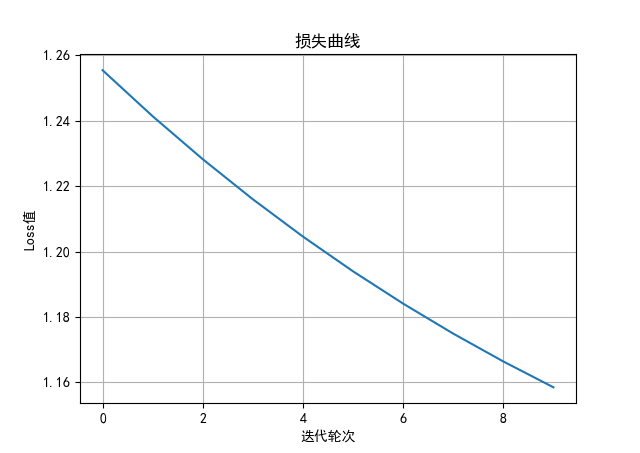|
| Exp 1 | lr=0.01, epoch=10 |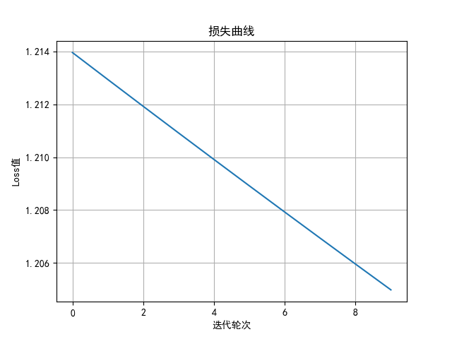|
| Exp 2 | lr=0.1, epoch=50 |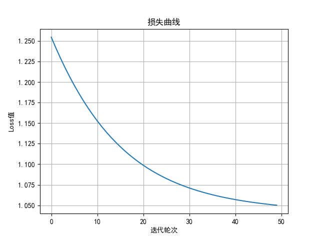|
| Exp 3 | lr=0.01, epoch=50 |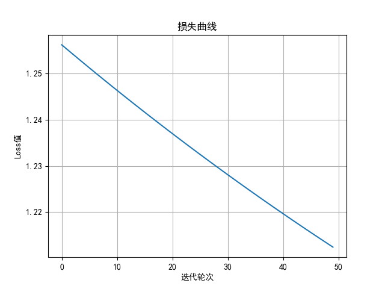|

### Reflection
The experiment shows that as the number of iterations increases, the loss value decreases, while decreasing the learning rate increases the loss value. Therefore, we can conclude that: 
1. more iterations result in a smaller loss value, but it will eventually approach a certain value;
2. decreasing the learning rate does not necessarily lead to a decrease in the loss value, thus requiring careful selection of the learning rate.

## PyTorch CIFAR10

### goal

Run a basic image classification training pipeline using PyTorch.

### What I Did

- Loaded CIFAR10 dataset
- Trained a CNN model
- Tested the model accuracy
- Changed one training parameter and compared results

### Key Concepts

- Dataset:用来表示数据集，负责保存图片和对应标签
- DataLoader:用于按批次读取数据，batch_size按照指定大小加载数据，shuffle打乱数据顺序，num_workers指定加载数据的线程数
- Model:定义了一个简单的卷积神经网络
- Loss:损失函数，多分类任务采用交叉熵，计算模型输出和真实标签之间的差距
- Optimizer:根据梯度来调整模型的参数
- Training loop:训练次数，每次迭代中计算损失并更新参数

### Results

| Experiment | Change | train_loss | test_loss | Accuracy（%）| Observation-loss | Observation-accuracy |
|---|---|---|---|---|---|---|
| Baseline | epoch=5，batch_size=64,lr=0.01 | 0.632 | 0.8054 | 72.55 |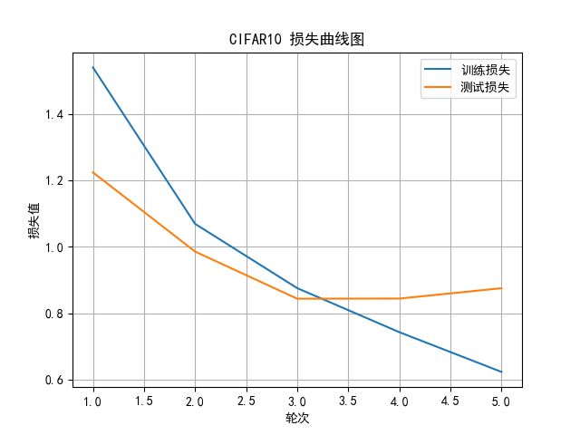|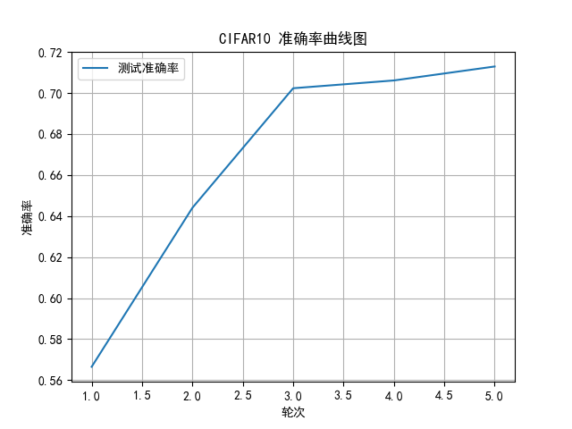|
| Exp 1 | epoch=10，batch_size=64,lr=0.01 | 0.1908 | 1.2105 | 71.35 |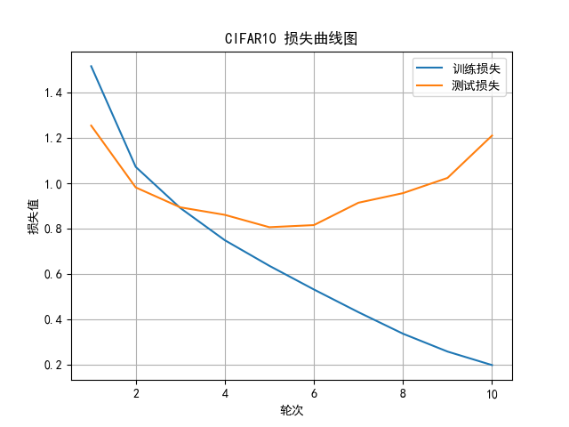|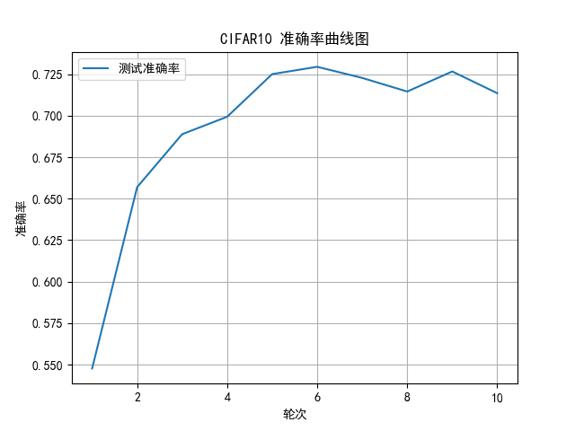|
| Exp 2 | epochs=5, batch_size=64, lr=0.001 | 1.2720 | 1.2465 | 55.19 |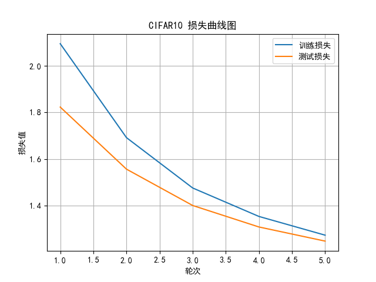|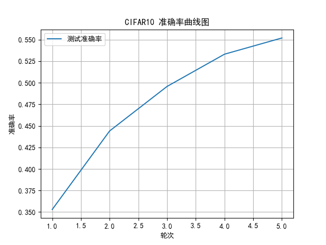|
| Exp 3 | epochs=5, batch_size=32, lr=0.01 | 0.5108 | 0.8851 | 71.62 |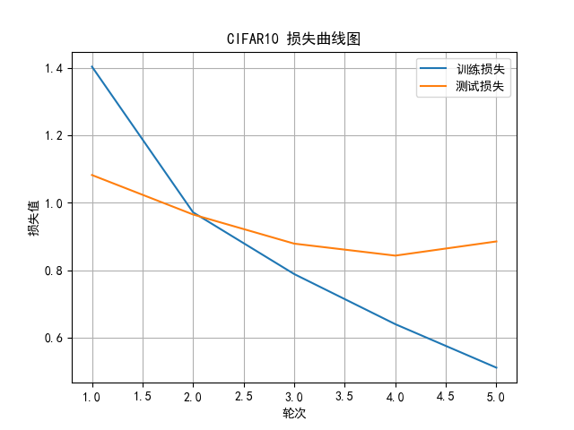|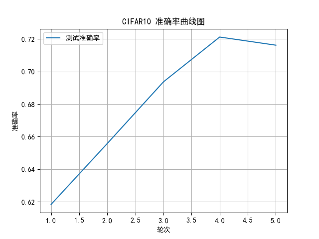|
Conclusions：
1. 对比base和exp1，随着迭代轮次的增加，准确率没有得到明显的变化，当然也有可能是迭代轮次不够；
2. 对比base和exp2，学习率过小，模型学的并不够好，可以看到准确率明显下降，并且训练损失和测试损失都明显增大；
3. 对比base和exp3，批次大小减小以后，对三个量变化都不大

### questions
1. 图片从哪里来？
   图片通过torchvision的数据集接口torchvision.datasets.CIFAR10来下载
2. 图片进入模型前是什么形状？
   图片进入模型前是3×32×32
3. 模型输出是什么形状？
   batch_size×10
4. loss 怎么计算？
   通过交叉熵损失利用模型计算所得得分与真实标签值计算
5. 参数什么时候更新？
   参数在每次迭代中通过optimizer.step()更新
6. 测试准确率怎么算？
   准确率通过测试样本总数与正确分类样本数的比值计算，正确样本分类数通过比较模型预测值中最大值与真实标签值是否相等来计算，
7. 曲线数据从哪里来？
   曲线数据来自每一轮训练和评估后保存的列表：

### Reflection

This week I learned:
1. How to build a simple classification model using PyTorch
2. How to load and preprocess the CIFAR10 dataset
3. How to train a CNN model and evaluate its performance
4. The impact of training parameters such as learning rate and batch size on model performance
5. The importance of monitoring training and testing loss and accuracy to understand model behavior
6. The need for careful parameter tuning to achieve good results in deep learning models
7. The importance of visualizing training progress through loss and accuracy curves to identify potential issues such as overfitting or underfitting.